In this post I'll be going over my journey of deciding on, searching for, buying, and importing my 2005 Mitsubishi
Delica Space Gear from Japan to Canada. The whole process took about six months: my search for a Delica began in October
2020,
[ended four months later](https://twitter.com/iAligator/status/1366257815191310336) on February 28, 2021, and the van
spent its [first night parked at home](https://twitter.com/iAligator/status/1385077315437162504) in Vancouver about two
months after that on April 21, 2021.

### Why a Delica?

Why not an RV? Or a Westfalia? Or something local and left-hand drive? I got these questions a lot when I first began my
search. There are several logical answers to these questions, the Delica provides:

- off-road capability with high ground clearance, 4x4, locking diffs
- Crystal Lite Roof (an option that [made the search way more difficult](https://www.instagram.com/p/COVrA1DMhcY/))
- practical size: although it's decently roomy inside for camperizing, it still drives like a regular car/SUV and fits
  in most parking spaces
- great value: you get a lot of car for the price and also get Japanese reliability

Frankly, I learned most of the above _after_ I started my search for a Delica. The reality of it is that I saw a few
Delicas while in Vancouver Island and thought they were damn cool cars. Having always been fascinated by JDM cars, I
returned home from that trip having decided that I want a Mitsubishi Delica. And that's how my hunt began. The rest I
learned along the way and only reinforced my decision.

### The Search

The day after I returned from Vancouver Island, I went to Vancouver Velocity Cars which specializes in selling JDM
vehicles. They had a few Delicas on their lot which I checked out alongside some Toyota Hiaces and Alphards. This
provided a baseline understanding of Delicas and other similar JDM vehicles.

| 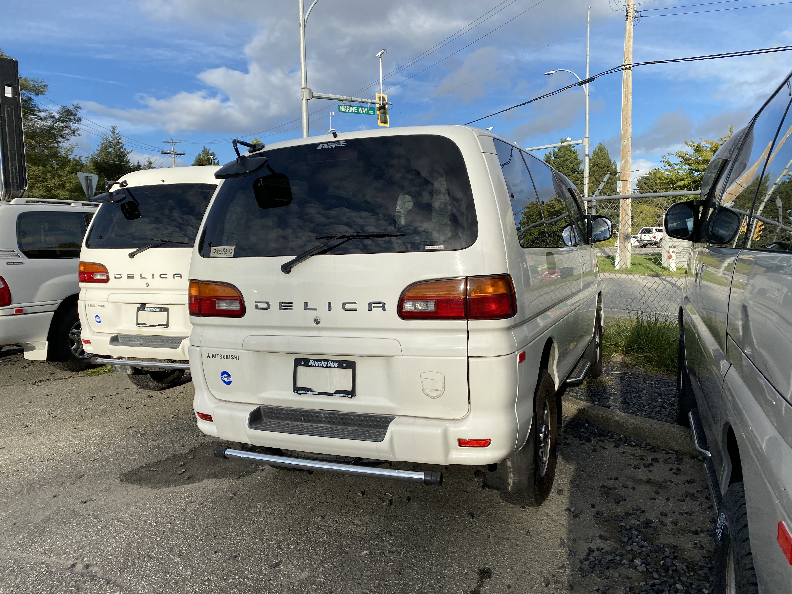  | 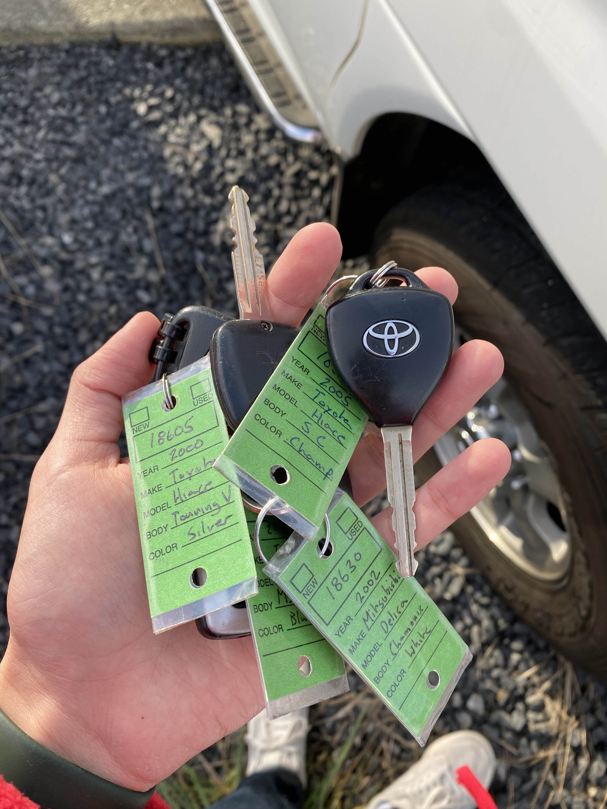  |
|:---:|:---:|

Over the next two months, I kept tabs on Delicas that popped up on Craigslist and checked out a handful in-person.
Although none of the local listings checked all the boxes in terms of condition, price, and spec, I learned a lot about
Delicas during this time which helped me narrow down what I was looking for when I eventually decided to look in Japan.

Years prior, I'd looked into importing a Toyota Supra from Japan. It didn't pan out as I eventually decided getting a
manual, RWD, RHD Supra as a first car in snowy Calgary wasn't the move. However, I still had a contact who specialized
in importing JDM cars to Canada: William from JDM Connection. A few days before Christmas, I reached out to William,
letting him what I was looking for and at what price. I signed an import agreement, put down a $1000 deposit, and got
access to a portal that gave me access to all the Delicas going on auction across Japan.

I set up my email alerts and over the following two months, I scanned the market looking for Delicas in decent condition
with the following:

- Crystal Lite Roof
- gas engine (6G72)
- <200,000km
- no frame rust

Although auction reports in Japan are usually pretty detailed, they don't always tell the full story. Also, I can't read
Japanese. If a van came up that seemed to meet my crtieria, I would send it over to William who would then send me the
translated auction report. If the report checked out, we would then arrange for someone in Japan to go check it out
further and take additional photos (as you can see below, auction photos can be pretty low resolution).

| 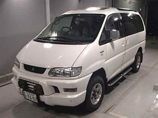 | 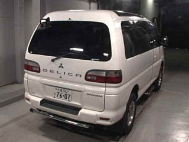  |
|:---:|:---:|
| 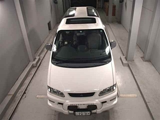 | 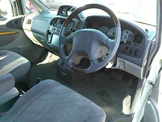  |
| 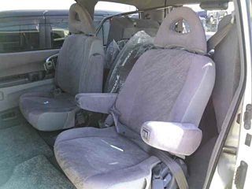 | 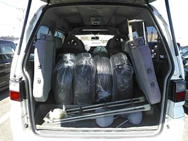  |

A few hours before the auction started, I would get better photos which would highlight the car's condition and defects.
Using those and William's input, I would make the call on whether I would bid on the van and if so, what my maximum
landed price would be. Based on my max landed price (which includes shipping, taxes, and other fees), William would
calculate the maximum auction bid and someone would participate in the auction on my behalf. During this 2-month period,
I bid on 10 or so vans. A lot of them went for much more than I expected which was pretty demoralizing.

|  |   |
|:---:|:---:|
| 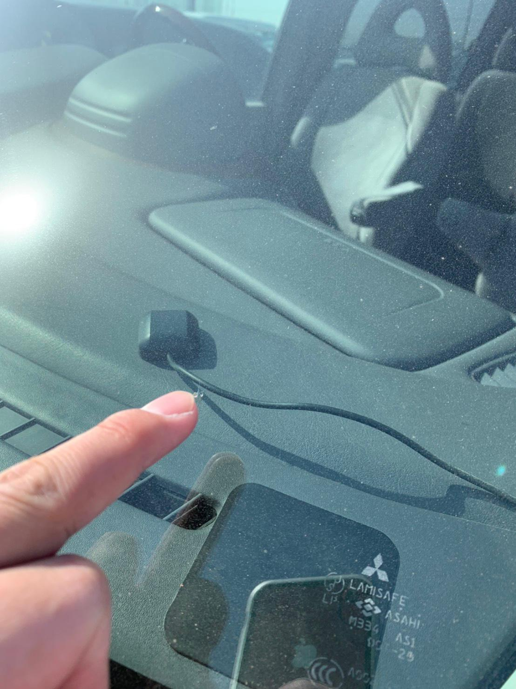 | 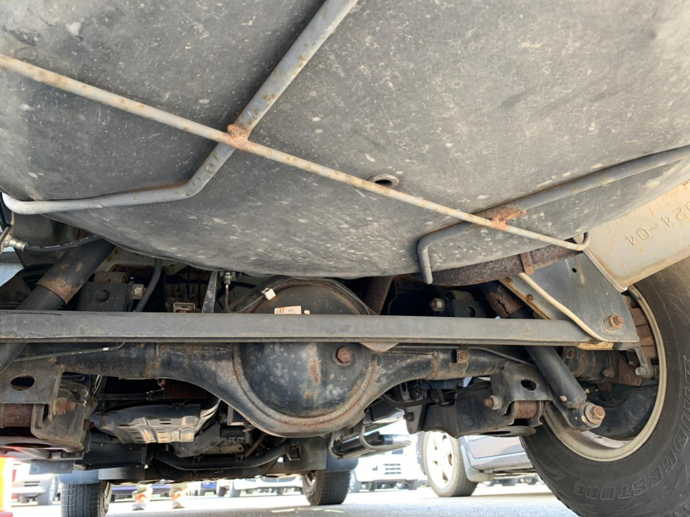  |

Late February, this van came up on auction which checked all the boxes for me. The auction inspection photos looked
great (above are a few) and given its condition and spec, I set a max bid that was relatively higher than previous ones.

*...I won!!!* And for a few grand less than what my max was set to as well which was a nice bonus. The search was
finally over. I arranged for payment, and the next chapter began: getting the van to Vancouver.

### Leaving Japan

Other than patience, this part didn't require much from me. I had the option of sending the van to a yard in Japan for
30,000 JPY to get the ladder that it had inside installed. There was a chance the ladder would be removed as there's a
no-cargo policy when shipping vehicles if it wasn't installed (which turned out to be the case). Not having a dire need
for a ladder (other than looks), I opted to have the van sent directly to the port at no extra charge. Customs clearance
at the port in Japan and arranging for shipping took a few weeks. The van was aboard the New Nada by the end of March.

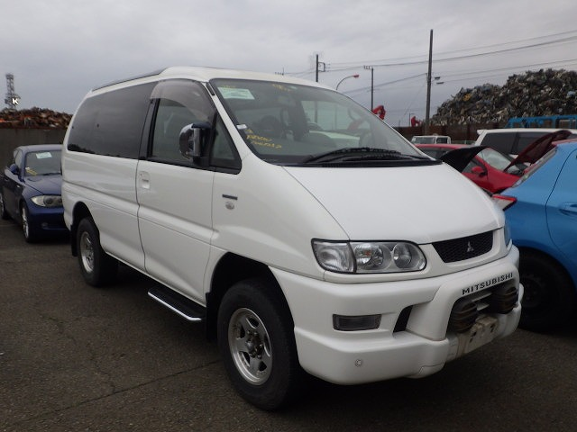

### Arrival in Canada

At long last, the van arrived at the port in Vancouver on April 12th, but I wouldn't get to see it for another week
until it cleared customs in Canada. Due to the COVID-19 pandemic, the port was closed to the public, so I had to pay a
towing company to tow the van across the street from the port in Richmond...

| 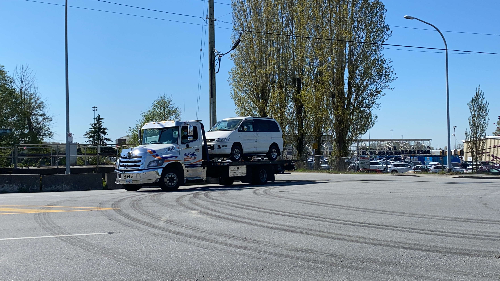 | 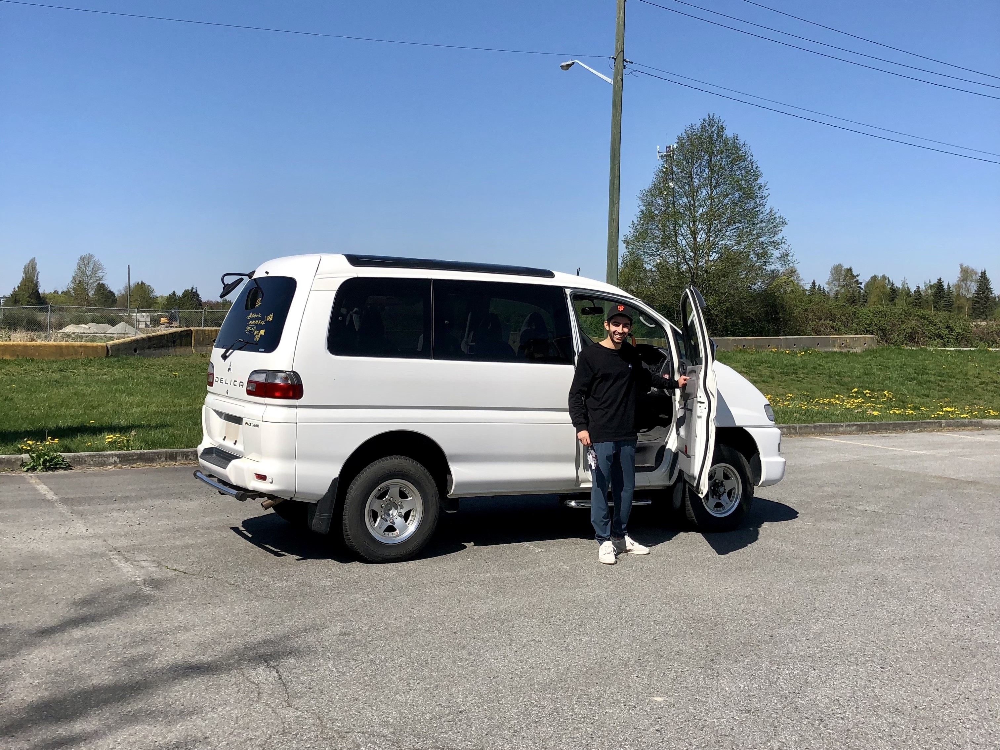  |
|:---:|:---:|

I had gotten a driving permit to take the van from the port to a shop in North Vancouver for an out-of-province
inspection. Giddy with excitement, I drove off in the van for the very first time on April 20th (*nice*). It needed
daytime running lights, some reflectors, and a new set of tires to pass inspection as the tires were quite old. It spent
the night at the shop and the next day, it was ready with a passing BC out-of-province inspection report and a fresh set
of BFGoodrich KO2 tires.

Then I was off to an ICBC insurance broker to get the car registered and insured. It only took a few lengthy visits
before I was able to get that done as there were technical issues with the van's VIN having fewer characters than what
ICBC's systems allowed for. On April 22nd, the van was finally insured and ready to drive and I breathed a huge sigh of
relief.

Of course this was only the first chapter of my journeys with the Delica. As I write this, I've begun work on
camperizing the van which I hope to document in future posts. You can also
follow [@20gear on Instagram](https://instagram.com/20gear) for more updates.
